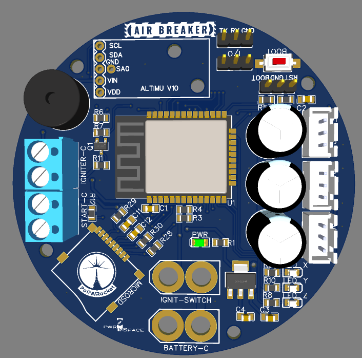
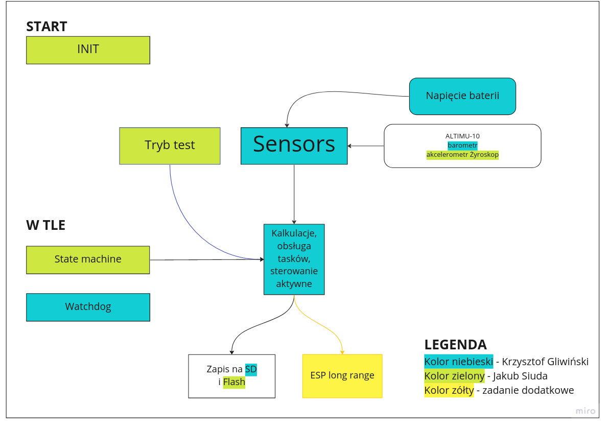

# Brakev2

## AirBreaker electronics module

The airbreaker main computing board consists of:
  - ESP32 MCU
  - AltIMU10-v5:
    - LPS25H accelerometer
    - LIS3MDL altimeter
    - LSM6DS33 gyroscope
  - 3x servomechanism control units
  - MicroSD card for data logging
  - General purpose I/O's for Igniter control, LED drive etc.



## Program structure:



## ESP-IDF version

Brakev2 project is written on the ESP32 platform using [ESP-IDF release version v5.0](https://github.com/espressif/esp-idf.git).

## Lint:

Install cpplint
```
  pip3 install cpplint
```
Run lint
```
  bash lint.sh
```

## WIDZISZ MNIE?

